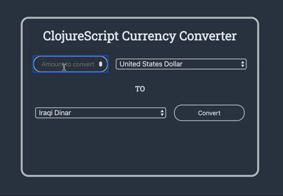

# ClojureScript Currency Converter

---
A currency converting app using clojurescript and reagent

[View it live here!](https://clojurescript-currency-converter.netlify.com/)

## Technology

- ClojureScript
- Leiningen
- Reagent
- cljs-http
- fixer.io API

## Takeaways

I used this project as an opportunity to explore ClojureScript and functional programming concepts. My first big takeaway is that functional programming is beautiful in its brevity, there were a couple of moments during the development process where I was blown away with how little I actually had to write to solve a problem. I really enjoyed the hiccup syntax and the ease of use that reagent offers.

If I was to spend more time working on this app, I would add in some form validation as well as writing to the atom onChange of the input which could allow for a "live view" of what the conversion would be. I would also add in a swap button/functionality to more easily convert between currencies.

